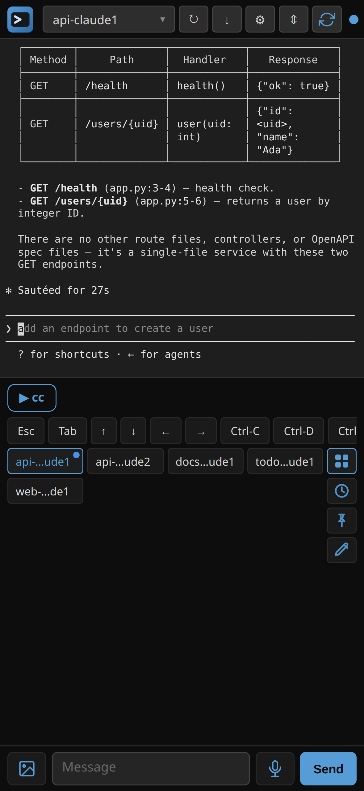
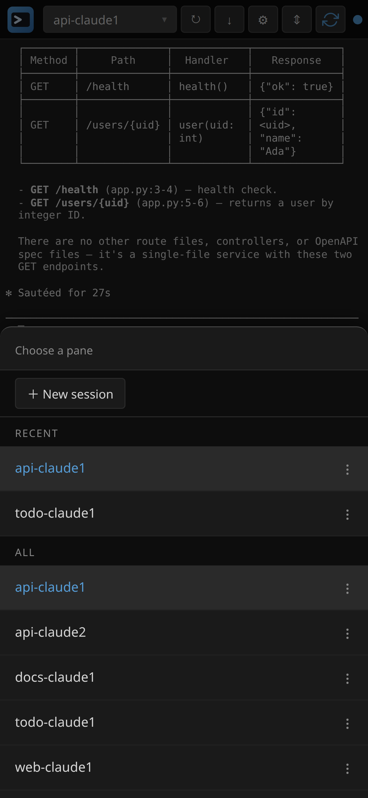
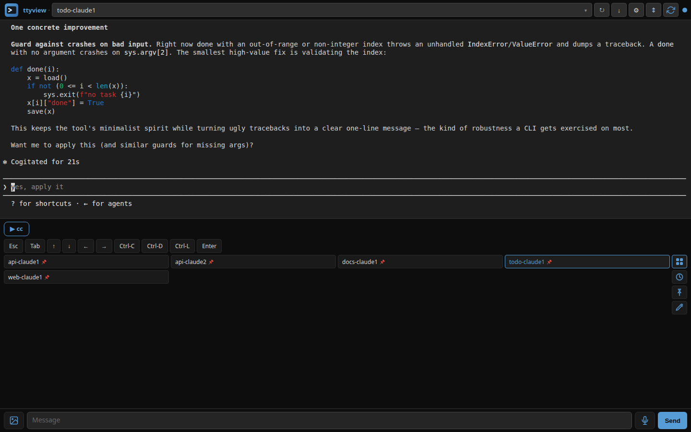
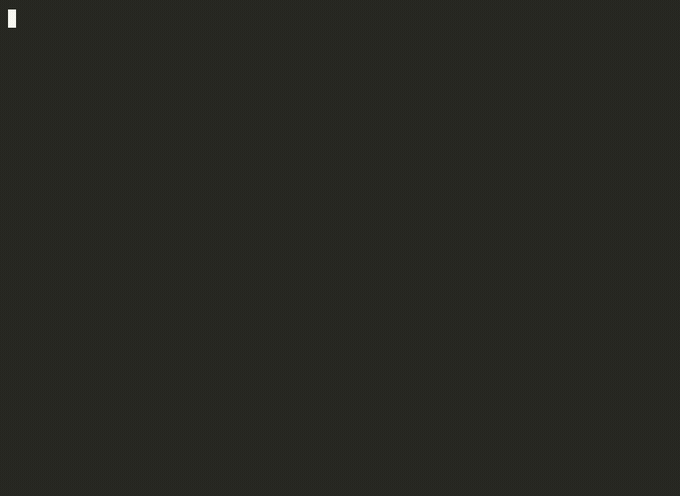
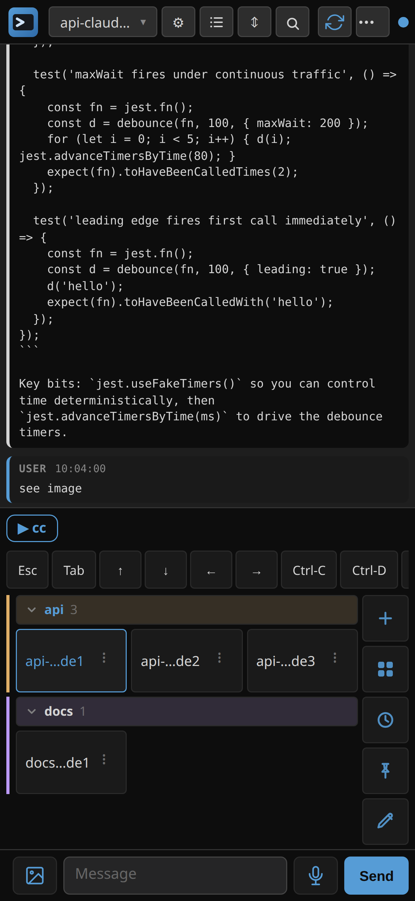

# mobile-cc

[](https://github.com/eyalev/mobile-cc/actions/workflows/ci.yml)
[](https://github.com/eyalev/mobile-cc/releases/latest)
[](./LICENSE)

**Drive Claude Code from your phone — or any browser.** mobile-cc puts your
Claude Code sessions on a tap-friendly web page: read the conversation, type
back, and switch between projects — no SSH client, no copy-paste fights, and
not a single tmux shortcut to memorize.

<p align="center">
  
</p>

It runs as one ~9 MB binary on the **same machine** as Claude Code and serves
a web UI you open from your phone or your desktop. It uses `tmux` under the
hood to keep sessions alive across disconnects — but **you never have to learn
tmux**: mobile-cc creates, names, and switches sessions for you, from buttons.

---

## Juggle every project from one screen

Running Claude Code in five repos at once? Each session is a tab. Tap to jump
between them; tap **+ New session** to start another — no `tmux new`, no
`Ctrl-b` gymnastics. Tabs survive restarts, and a dot flags any session
waiting on a permission prompt or with fresh output, so you know which project
needs you.

<p align="center">
  
</p>

---

## See it

You get the **real Claude Code TUI**, rendered live — syntax highlighting,
dialogs, permission prompts and all — auto-fit to your screen so an 80-column
terminal is readable without pinch-zooming. A quick-keys row adds `Esc`,
`Tab`, `Ctrl-C`, and arrows that phone keyboards hide, and you type replies in
the box at the bottom.

<p align="center">
  
</p>

## Great on the desktop, too

Open the same URL in a desktop browser and the terminal widens to fill the
window at a comfortable density — a full-width Claude Code session with your
project tabs down the side. Same tool, same tabs, phone and laptop in sync.

<p align="center">
  
</p>

---

## Quickstart

You need a machine (Linux or macOS) that your phone can reach over
[Tailscale](https://tailscale.com/). Four steps:

### 1. Start a Claude Code session

mobile-cc keeps your sessions alive in `tmux`, so start one there:

```bash
tmux new -s my-project   # a named session
claude                   # run Claude Code as usual
```

New to tmux? You don't need to be. Install mobile-cc (next step), open the UI,
tap **+ New session**, then run `claude` inside it — that's the last time tmux
is even mentioned.

### 2. Install mobile-cc

```bash
curl -fsSL https://mobile-cc.dev/install.sh | bash
```

<p align="center">
  
</p>

This downloads the binary to `~/.local/bin/mobile-cc`, verifies its
checksum, installs a **systemd user service** that starts it (and restarts
it on boot), and prints your URL. It binds `127.0.0.1:7800` — loopback only.

> **macOS / no systemd?** The installer just drops the binary and tells you
> the command to run it yourself. See [Running it manually](#running-it-manually).

### 3. Expose it to your phone over Tailscale

mobile-cc only listens on `127.0.0.1`, so your phone can't reach it directly.
[Tailscale](https://tailscale.com/) gives the machine a private HTTPS address
that only your devices can see:

```bash
tailscale serve --bg --https=443 http://127.0.0.1:7800
```

That prints an `https://<machine>.<your-tailnet>.ts.net/` URL. (The installer
also prints this if Tailscale is already set up.)

### 4. Open the URL on your phone or laptop

Install Tailscale on the device you want to drive from (phone app or desktop
client), sign in to the same account, then open that `https://…ts.net/` URL in
any browser. Pick the session running Claude Code from the picker at the top —
and you're driving it.

> Because it's served over HTTPS, Chrome on Android offers **Add to Home
> screen**, and mobile-cc opens like a standalone app.

---

## What you get

- **No tmux knowledge required** — create, name, switch, and kill sessions from
  buttons. Even if you live in tmux, you never reach for `Ctrl-b` again.
- **The real Claude Code TUI** — the actual terminal, rendered as live cell
  state (not screen-scraped images), with syntax highlighting. Auto-fits a
  phone screen and widens to fill a desktop window.
- **Quick-keys row** above the keyboard — `Esc`, `Tab`, `Ctrl-C`, arrows.
- **Project tabs** — every session is a tab; switch with one tap. Survives
  restarts (pinned by session name). Dots flag a session waiting on a
  permission prompt or with new output.
- **Image paste / pick** — attach a screenshot from your phone; it's staged on
  the server and inserted as `[image: /path/...]`, which Claude Code reads just
  like a desktop paste.
- **Command chips** — one-tap buttons above the message box for commands you
  send often.
- **Voice input** — dictate a message (Web Speech, or Groq Whisper with a key).
- **Chat-style transcript reader** — a clean, scrollable plain-text view of the
  conversation read from the JSONL on disk. One tap from the terminal view —
  handy for reading back a long session.
- **Installable (PWA)** — add it to your home screen; opens standalone.

<p align="center">
  
</p>

---

## Reaching it from other devices

mobile-cc binds `127.0.0.1` only and has **no built-in authentication** —
anyone who can reach the port can drive your shell. So every supported way to
reach it from another device puts an authenticating layer in front. Tailscale
(above) is the recommended one. Others:

| Pattern | Auth | Best for |
| --- | --- | --- |
| **Tailscale** (recommended) — `tailscale serve --bg --https=443 http://127.0.0.1:7800` | Tailnet ACL + TLS | Phone access. Real HTTPS via Let's Encrypt at `https://<host>.<tailnet>.ts.net/`. |
| **`ssh -L 7800:127.0.0.1:7800 <host>`** | SSH key | A laptop or any device with SSH access. Zero extra infra. |
| **[Cloudflare named tunnel](https://developers.cloudflare.com/cloudflare-one/connections/connect-networks/) + [Access](https://www.cloudflare.com/zero-trust/products/access/)** | Cloudflare SSO | A public URL with browser-based login. |
| **Reverse proxy (Caddy / nginx) + auth** | Whatever you bring | Existing infra with an auth layer you trust. |

**Not supported:** binding to `0.0.0.0` or a LAN / public IP directly. The
binary refuses it since v0.2.0 — every "trusted LAN only" deployment of an
auth-less shell has a long history of accidental exposure. The patterns above
are the same effort once and remove that failure class.

For the security policy, see [SECURITY.md](./SECURITY.md).

---

## Reference

### Install options

| Env var | Effect |
|---|---|
| `MOBILE_CC_VERSION=v0.3.2` | Install a specific release (default: latest). |
| `MOBILE_CC_PREFIX=/path` | Where to put the binary (default `~/.local/bin`). |
| `MOBILE_CC_SKIP_UNIT=1` | Don't write a systemd unit. |
| `MOBILE_CC_BIN_FILE=/path` | Install a local binary instead of downloading. |

Survive logout (keep the service running after you close SSH):

```bash
loginctl enable-linger $USER
```

### Running it manually

```bash
mobile-cc --bind 127.0.0.1:7800
```

| Flag | Default | What |
|---|---|---|
| `--bind` | `127.0.0.1:7800` | Address to bind. Loopback only — refuses anything else. |
| `--app-name` | `mobile-cc` | Shown in the header / PWA title. |
| `--tmux-socket` | (default tmux) | Tmux socket name (`tmux -L`). |
| `--config-dir` | `$XDG_CONFIG_HOME/mobile-cc` | Where the plugin manifest lives. |

That's the whole CLI — by design. mobile-cc is a curated package, not a
kitchen-sink terminal viewer.

### Uninstall

```bash
systemctl --user disable --now mobile-cc
rm -rf ~/.config/mobile-cc ~/.config/systemd/user/mobile-cc.service
rm -f  ~/.local/bin/mobile-cc
```

### Build from source

```bash
git clone https://github.com/eyalev/mobile-cc
cd mobile-cc
cargo build --release
```

Requires a checkout of [`ttyview`](https://github.com/ttyview/ttyview) at
`../ttyview` (sibling dir) — mobile-cc consumes `ttyview-core` as a path
dependency until it's published to crates.io.

---

## How it works

mobile-cc is a thin Rust binary that links [`ttyview-core`](https://github.com/ttyview/ttyview)
as a library and bakes in a fixed plugin set + the mobile-CC defaults. Every
plugin, protocol, and UI component is upstream ttyview — mobile-cc owns the
packaging shape and release cadence, nothing else. It is *not* a fork.

## License

MIT.
