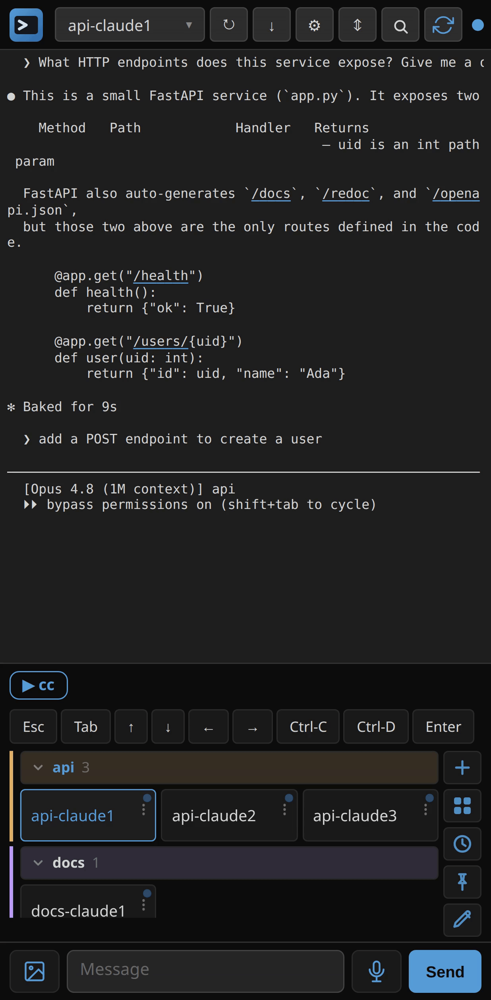
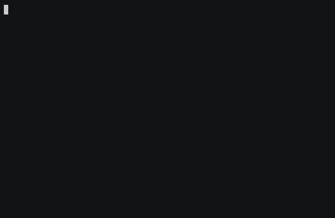

<!-- GENERATED by demos/gen-gallery.mjs from demos/manifest.json — DO NOT EDIT BY HAND. -->
<!-- Regenerate: `node demos/gen-gallery.mjs` (also runs at the end of every capture). -->

# Demo gallery

Every mobile-cc demo, each one a reproducible test (see [`CONVENTIONS.md`](CONVENTIONS.md)). The GIFs below autoplay inline; click any one (or the **MP4** link) for the sharper video, and **recipe** for the capture script.

## Drive a live Claude Code session

The real Claude Code TUI rendered live in the browser — project-grouped tabs (api ×3 + docs), quick-keys row, a reply composed in the Message box. The README 'See it' clip.

▶ [MP4](https://github.com/user-attachments/assets/20722bea-3965-4ef9-8d72-68dbd8a2ed1d) · [recipe](workflows/use-flow.mjs)

---

## A day with mobile-cc

The day-in-the-life flow: open this morning's session, compose a reply (one-tap command chips above the box), spin up a second workspace, get a 'needs you' status dot on a session waiting at a permission prompt, jump to it, and use the pane picker to find any session. Near-fresh → juggling multiple tabs. Linked from demos/README.md (not the README hero yet).

▶ [MP4](../docs/media/day.mp4) · [recipe](workflows/day-in-the-life.mjs)

---

## Switch projects with one tap

Start in the api project, tap the docs project's tab, land on it — the project-grouped tab rail in action. Captured, not README-linked (yet).

▶ [MP4](../docs/media/tab-switch.mp4) · [recipe](workflows/tab-switch.mjs)

---

## Pick a session from the picker

Open the pane picker (Recent + project groups + ＋ New session) and jump to a session. Captured, not README-linked (yet).

▶ [MP4](../docs/media/pane-picker.mp4) · [recipe](workflows/pane-picker.mjs)

---

## Read the session as a chat transcript

Flip from the live terminal to the chat-style transcript reader (ttyview-cc). Switched via the internal view API — the build ships no UI control for it (see UX issue). Captured, not README-linked.

▶ [MP4](../docs/media/chat-view.mp4) · [recipe](workflows/chat-view.mjs)

---

## Start a session from a button

Tap ＋ on the tab rail → the three-way new-session menu → create a bare shell, a new tab appears. Captured, not README-linked.

▶ [MP4](../docs/media/new-session.mp4) · [recipe](workflows/new-session.mjs)

---

## Image paste end-to-end

Paste a screenshot into the Message box -> uploads to the daemon -> Claude Code's vision pipeline reads the [image:/abs/path]. Captured, not README-linked (yet).

▶ [MP4](../docs/media/paste.mp4) · [recipe](workflows/paste-flow.mjs)

---

## Install via curl | bash

The `curl ... | bash` install flow: download from GitHub Releases, verify (minisign/provenance/sha256), drop the systemd user unit, print the URL.

▶ [MP4](https://github.com/user-attachments/assets/e38891e6-946f-41db-b7de-c65f66f2a6b2) · [recipe](terminal/install.sh) · `terminal`

---

## Install via Homebrew

`brew install eyalev/tap/mobile-cc` — the tap install path (binary only, no systemd unit).

▶ [MP4](https://github.com/user-attachments/assets/af1e0d4e-0d51-4584-9abe-457793d43678) · [recipe](terminal/brew-install.sh) · `terminal`

---

9 demos · generated from `manifest.json` by `gen-gallery.mjs`.
